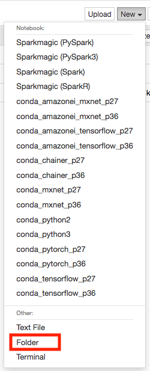
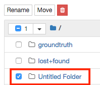

## Working with Groud Truth

In this module, you will learn how to create an end-to-end workflow that demonstrates the functionality of 
SageMaker Ground Truth. We'll start with an unlabeled image data set, acquire labels for all the images using SageMaker 
Ground Truth, analyze the results of the labeling job, train an image classifier, host the resulting model, and, 
finally, use it to make predictions. 

You will use SageMaker notebook in this module.  To proceed, follow these steps:

1. Go to the Jupyter homepage from the SageMaker notebook instance.

2. Create a new folder in Jupyter.

3. Rename the new folder from **Untitled Folder** to **GroundTruth**  

4. Go in to the GroundTruth folder and upload the [Ground Truth notebook](../notebooks/ground_truth_end_to_end.ipynb)

5. When you're finished, return back to [**Introduction to SageMaker**](../Introduction) to move on to the next module.

