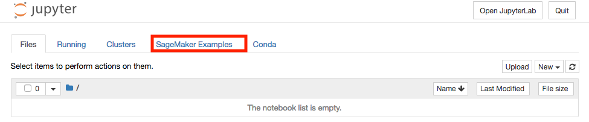
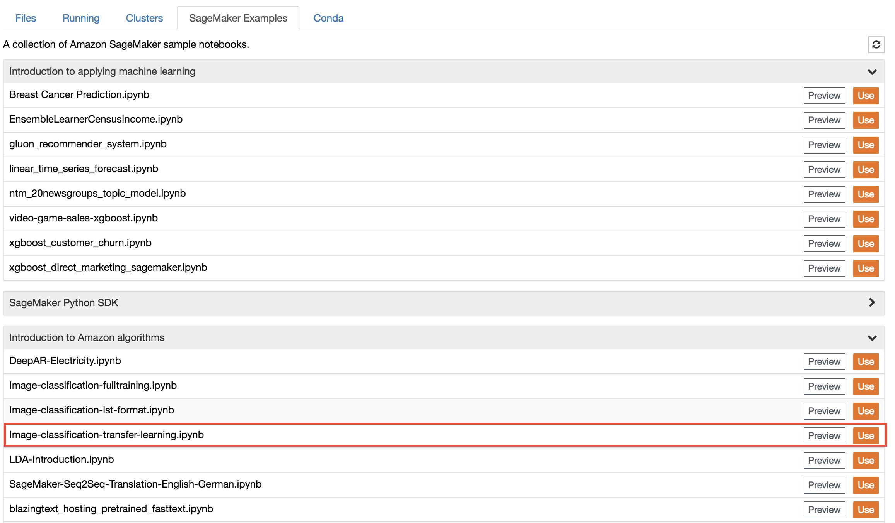

## Image Classification with Transfer Learning

In this module, we'll work with an image classification example notebook. In particular, we'll use Amazon SageMaker's built-in image classification algorithm, which is a supervised learning algorithm that takes an image as input and classifies it into one of multiple output categories. 

We will also use the algorithm's transfer learning mode to fine-tune a pre-trained model that was trained on imagenet data to learn to classify a new dataset from Caltech. The technique of transfer learning is basically using an existing trained model and resuse it to train a new model. This is very useful when a large number of training images are not available and can also speeds up the training process significantly as it is not training from complete scratch. Even if you don't have experience with neural networks or image classification, SageMaker's image classification algorithm makes the technology easy to use, with no need to design and set up your own neural network.  

To proceed, follow these steps:

1. For this part of the module, we'll be using a SageMaker notebook instance to explore and visualize a data set.  

2. Go to the Jupyter homepage from the SageMaker notebook instance.

3. In the Jupyter homepage, click on the SageMaker Examples tab and click on the **Use** button in **Image-classification-transfer-learning.ipynb** row.

4. In the pop up dialog box, click **Create copy** button to create and launch a copy of the notebook.

5. Follow the directions in the notebook.

<strong>NOTE:  training the model for this example typically takes about 10 minutes.</strong> However, keep in mind that this is relatively short because transfer learning is used rather than training from scratch, which could take many hours.

