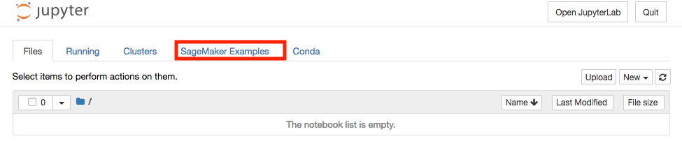

## Parallelized Data Distribution

In this module, you will learn about how to take full advantage of distributed training clusters when using one of SageMaker's built-in algorithms. You will train two jobs and in the first job, you'll use ***FullyReplicated*** for your train channel. This will pass every file in your input S3 location to every machine (in this lab, 5 machines).
In the second job, you'll use ***ShardedByS3Key*** for the train channel, this means that data are distributed and each machine will only train on a fraction of the data. This is especailly useful when you have a large training dataset that can not be fit on a single machine.

To proceed, follow these steps:

1. Go to the Jupyter homepage from the SageMaker notebook instance.



2. In the Jupyter homepage, click on the SageMaker Examples tab and click on the **Use** button in **data_distribution_types.ipynb** row.


3. In the pop up dialog box, click **Create copy** button to create and launch a copy of the notebook.

4. Follow the directions in the notebook.

***NOTE:  training the model for this example typically takes about 10 minutes.***

5. In the ```bucket = '<your_s3_bucket_name_here>'``` code line, paste the name of the S3 bucket you created in [**Creating a Notebook Instance**](../NotebookCreation) to replace ```<your_s3_bucket_name_here>```.  The code line should now read similar to ```bucket = 'sagemaker-workshop-john-smith'```.  Do NOT paste the entire path (s3://.......), just the bucket name. 

6. When you're finished, return back to [**Distributed Training with SageMaker**](../Distributed) to move on to the next module.
