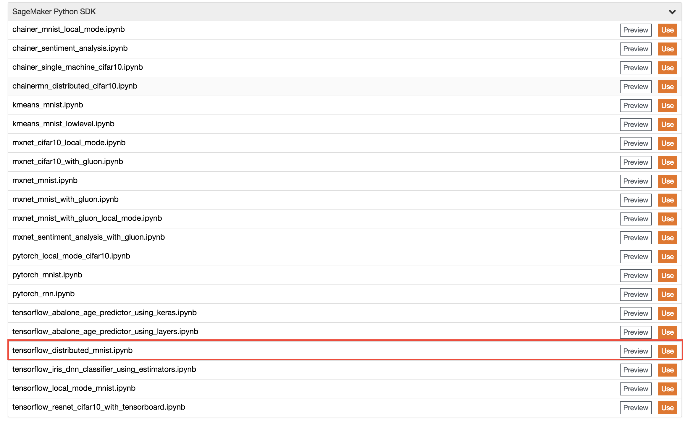

## Distributed Training with TensorFlow 

In this module, we will be using images of handwritten digits from the [MNIST Database](http://yann.lecun.com/exdb/mnist/) to demonstrate how to perform distributed training using SageMaker. The trained model will predict what the handwritten digit is in the image presented for prediction. The module will demonstrate how easy it is to set up and train a model on a cluster of multiple instances in distributed mode on SageMaker, makes model training exponentially faster. It will also demonstrate another powerful feature of SageMaker, the ability to bring your own custom TensorFlow script to train on SageMaker.   

To proceed, follow these steps:

1. Go to the Jupyter homepage from the SageMaker notebook instance.

2. In the Jupyter homepage, click on the SageMaker Examples tab and click on the **Use** button in **tensorflow_distributed_mnist.ipynb** row.

3. In the pop up dialog box, click **Create copy** button to create and launch a copy of the notebook.

4. Follow the directions in the notebook.

***NOTE:  training the model for this example typically takes about 10 minutes.***

5. When you're finished, return back to [**Distributed Training with SageMaker**](../Distributed) to move on to the next module.
