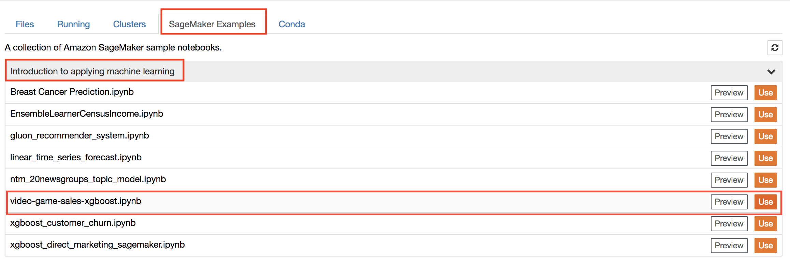

## Video Game Sales


In this module, we'll work our way through an example Jupyter notebook that demonstrates how to use a built-in algorithm in SageMaker. More specifically, we'll use SageMaker's version of XGBoost, a popular and efficient open-source implementation of the gradient boosted trees algorithm. 

Gradient boosting is a supervised learning algorithm that attempts to predict a target variable by combining the estimates of a set of simpler, weaker models. XGBoost has done remarkably well in machine learning competitions because it robustly handles a wide variety of data types, relationships, and distributions. It often is a useful, go-to algorithm in working with structured data, such as data that might be found in relational databases and flat files. 

This module also shows how to use SageMaker's built-in algorithms via hosted Jupyter notebooks and the SageMaker console.  To proceed, follow these steps:

1. **Exploratory Data Analysis**:  For this part of the module, we'll be using a SageMaker notebook instance to explore and visualize a data set.  

2. Go to the Jupyter homepage from the SageMaker notebook instance.


3. In the Jupyter homepage, click on the SageMaker Examples tab and click on the **Use** button in **video-game-sales-xgboost.ipynb** row.



4. In the pop up dialog box, click **Create copy** button to create and launch a copy of the notebook.

5. Follow the directions in the notebook.

6. In the ```bucket = '<your_s3_bucket_name_here>'``` code line, paste the name of the S3 bucket you created in [**Creating a Notebook Instance**](../NotebookCreation) to replace ```<your_s3_bucket_name_here>```.  The code line should now read similar to ```bucket = 'sagemaker-workshop-john-smith'```.  Do NOT paste the entire path (s3://.......), just the bucket name. 

7. In addition to the output of training job in Jupyter, you can also check the status of your training jobs in the SageMaker console.  the SageMaker console, click **Jobs** in the left panel to check the status of the training job.  When the job is complete, its **Status** column will change from InProgress to Complete.  As a reminder, duration of this job can last up to about 10 minutes, including time for setting up the training cluster.

- To check the actual training time (not including cluster setup) for a job when it is complete, click the training job name in the jobs table, then examine the **Training time** listed at the top right under **Job Settings**.  

